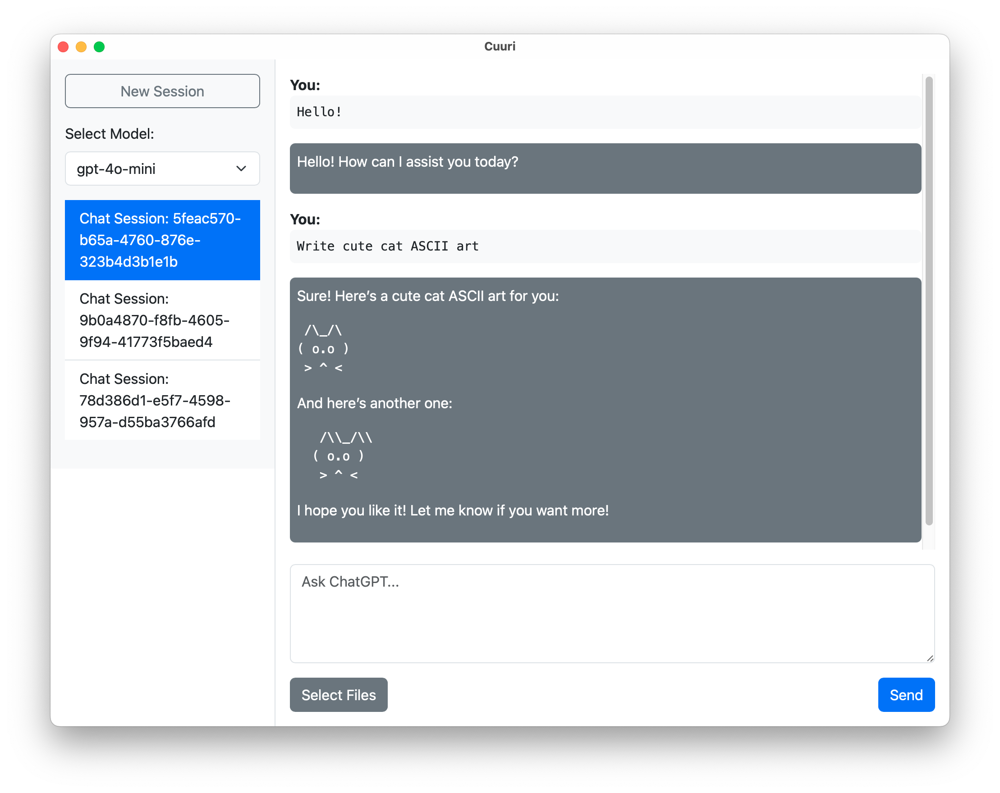

## Cuuri

    

<h1 align="center">Cuuri</h1>

Cuuri is a GUI client for ChatGPT built with Tauri, Vue, and TypeScript.

### Features

- Privacy
  - Your data is not sent anywhere except to OpenAI. All data resides within your storage. No debug logs are sent.

### Customize
All Cuuri data is saved under `$HOME/.cuuri`. Typically, the following files are generated automatically, so there's no need to edit them manually.

- `$HOME/.cuuri/chat.db`: The chat history is saved here.
- `$HOME/.cuuri/config.toml`
  - `default_model`: You can set the model that is selected at startup. Make sure the model name matches the one shown in the list.
  - `openai_api_key`: Set your OpenAI API key here.
